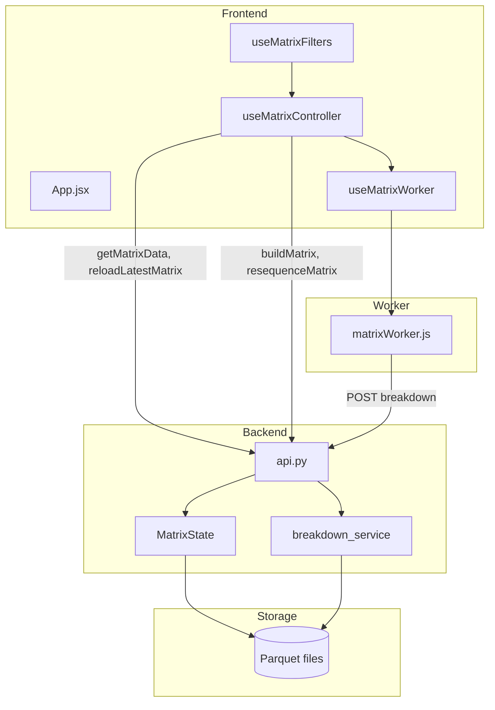

# Matrix Application Architecture

**Last updated:** March 2026

This document describes the architecture of the Matrix Timetable application: data flow, module boundaries, cache layers, and key files.

---

## Overview

The Matrix application displays trading execution timetables and statistics derived from analyzer output. It consists of:

- **Backend** (FastAPI + Python): Build, resequence, load matrix data, compute stats and breakdowns
- **Frontend** (React + Vite): UI, filters, tabs, virtualized tables
- **Web Worker**: Heavy client-side computation (filtering, stats, timetable, breakdown)

---

## Data Flow

### Load Flow

1. **Initial load:** `useMatrixController.loadMasterMatrix` → `matrixApi.getMatrixData` → FastAPI `/api/matrix/data` → `MatrixState` or disk → returns rows + `stats_full`
2. **Reload:** `reloadLatestMatrix` → `/api/matrix/reload_latest` → invalidates cache, fetches fresh data
3. **Worker init:** After load, `workerInitData` sends columnar data to worker; worker stores and applies filters

### Filter Flow

1. User changes filters → `updateStreamFilter` (useMatrixFilters)
2. Controller passes `streamFilters` to worker via `workerFilter`
3. Worker applies filters → `workerFilteredIndices` / `workerFilteredRows`
4. Stats and breakdown recalculated when filters change

### Stats Flow

- **Backend stats:** Full-history stats from `/api/matrix/data` (with `include_stats=true`) or `/api/matrix/stream-stats`
- **Worker stats:** Fallback when backend stats unavailable; computed from filtered rows in worker

### Breakdown Flow

- `calculateProfitBreakdown` → worker POST `/api/matrix/breakdown` (or worker-only for some breakdown types)
- Backend uses `breakdown_service.py` for day/dom/time/month/year/date/doy breakdowns

---

## Module Boundaries

| Layer | Key Files | Responsibility |
|-------|-----------|-----------------|
| **Backend API** | `modules/matrix/api.py` | FastAPI router: build, resequence, data, breakdown, stream-stats, freshness |
| **Backend core** | `master_matrix.py`, `data_loader.py`, `sequencer_logic.py`, `filter_engine.py`, `statistics.py` | Build, load, sequence, filter, compute stats |
| **Breakdown** | `breakdown_service.py` | Extracted breakdown logic (day, dom, time, month, year, date, doy) |
| **State/cache** | `matrix_state.py`, `cache.py`, `_matrix_data_cache` | In-process DataFrame cache, parquet discovery |
| **Frontend** | `App.jsx`, `StatsContent.jsx`, `DataTable.jsx`, `ErrorBoundary.jsx` | Main UI, tab orchestration, stats, filters |
| **Worker** | `matrixWorker.js` | Filtering, stats, profit breakdown, timetable (DOW/DOM/time helpers) |
| **Hooks** | `useMatrixController`, `useMatrixFilters`, `useColumnSelection` | State, API, filters, columns |
| **API client** | `matrixApi.js` | Thin wrapper around backend endpoints |

---

## Cache Layers and Invalidation

| Cache | Location | Key | Invalidation |
|-------|----------|-----|--------------|
| **Matrix data** | `api.py` `_matrix_data_cache` | (file_path, mtime, stream_include, contract_multiplier, include_filtered_executed, include_stats) | Build, resequence, reload |
| **Breakdown** | `api.py` `_breakdown_cache` | (file_path, mtime, breakdown_type, stream_include, contract_multiplier, use_filtered, stream_filters_hash) | Build, resequence |
| **Stream stats** | `api.py` `_stream_stats_cache` | (file_path, mtime, stream_id, include_filtered_executed, contract_multiplier) | Build, resequence |
| **MatrixState** | `matrix_state.py` | In-process DataFrame | `_invalidate_matrix_cache()` |
| **Worker** | `matrixWorker.js` | Filter cache, profit breakdown cache | Worker reinit on matrix change |

`_invalidate_matrix_cache()` is called after build, resequence, and reload operations.

---

## Key Files

| File | Purpose |
|------|---------|
| `modules/matrix/api.py` | API endpoints, cache management, request models |
| `modules/matrix/breakdown_service.py` | Breakdown by day/dom/time/month/year/date/doy |
| `modules/matrix/master_matrix.py` | Build master matrix from analyzer runs |
| `modules/matrix/matrix_state.py` | Load and cache parquet data |
| `modules/matrix_timetable_app/frontend/src/App.jsx` | Main app, tab composition |
| `modules/matrix_timetable_app/frontend/src/hooks/useMatrixController.js` | Data lifecycle, worker coordination, reload, resequence, auto-update |
| `modules/matrix_timetable_app/frontend/src/hooks/useMatrixWorker.js` | Worker lifecycle, message handling |
| `modules/matrix_timetable_app/frontend/src/matrixWorker.js` | Filter, stats, breakdown, timetable computation |
| `modules/matrix_timetable_app/frontend/src/api/matrixApi.js` | API client (build, resequence, data, breakdown, stream-stats) |
| `modules/matrix_timetable_app/frontend/src/utils/constants.js` | `CONTRACT_VALUES`, `DEFAULT_CONTRACT_VALUE` |

---

## Auto-Update

- **Interval:** Every 20 minutes (when enabled)
- **Behavior:** Calls `resequenceMasterMatrix()` which internally calls `reloadLatestMatrix()` after resequence completes
- **Refresh:** Incremental (no full page reload on success); `window.location.reload()` only as fallback when resequence fails

---

## Error Handling

- **ErrorBoundary:** Wraps `AppContent`; catches React render errors, shows fallback UI with reload button
- **API errors:** Surfaced via `masterError`, `workerError`, `backendConnectionError`
- **Logger:** `devLog` / `devWarn` used for debug output (guarded by `import.meta.env.DEV`)
